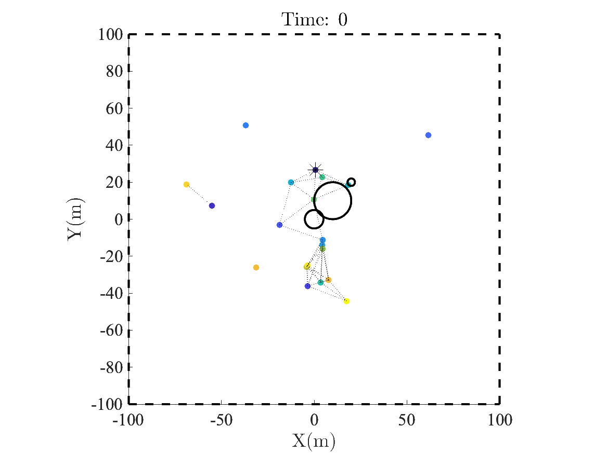

# Guidance-and-navigation
Sharif University of Technology course
Here used Vasarhely guidance law to guide a swarm of UAVs to a target. The code is written in MATLAB and the simulation is done in HIL using Arduino Mega2560.
Here is the link to the paper: https://www.science.org/doi/10.1126/scirobotics.aat3536
<!-- add gif of work -->
## How to run
1. Clone the repository
2. Open the MATLAB file and run it
3. Upload the Arduino code to the board
4. Run the simulation
## Simulation Results <!-- add gif result of work -->

## HIL Results <!-- add gif result of work -->
